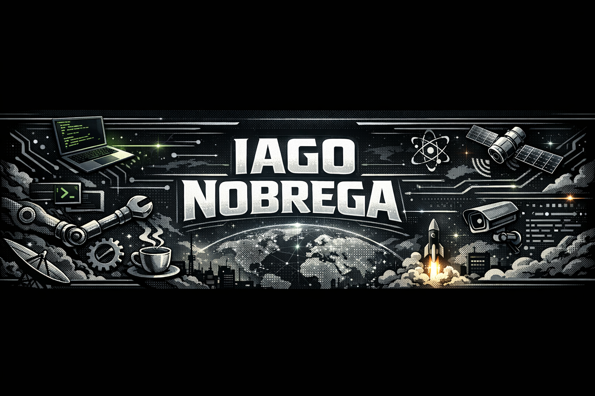

  

  
  
  
  
  
  
  

---

<h2>Sobre mim</h2>

Sou Graduado em  <strong>Análise e Desenvolvimento de Sistemas</strong> com foco em 
<strong>Qualidade de Software (QA)</strong> e <strong>Backend com Java</strong>.

Tenho experiência com suporte técnico e testes de software, atuando na identificação de falhas, melhoria de processos e garantia de qualidade.

<strong>Como penso:</strong> se algo é repetitivo ou manual, pode ser automatizado para ganhar eficiência e reduzir erros.

---

<h2>Foco no momento</h2>

<ul>
  <li>Automação de testes com <strong>Selenium, Cypress e Playwright</strong></li>
  <li>Desenvolvimento backend com <strong>Java + Spring Boot</strong></li>
  <li>Testes de API (REST)</li>
  <li>BDD com Cucumber</li>
  <li>Boas práticas de QA (TDD, CI/CD)</li>
</ul>

  

---

<h2>Projetos em destaque</h2>

  

🚀 Em construção:
- Framework de automação com Selenium + Java  
- Testes E2E com Cypress  
- API REST com Spring Boot  

---

  <table border="0" style="border-collapse: collapse;">
    <tr>
      <td></td>
      <td></td>
      <td></td>
    </tr>
  </table>

---

<h2>Stack e ferramentas</h2>

  
  
  
  
  
  
  
  
  
  

---

## Contato

  📍 Ilhéus - BA  
  📧 iago.n.araujo27@gmail.com  
  📱 (73) 98209-6194

  
  
  

---

  

